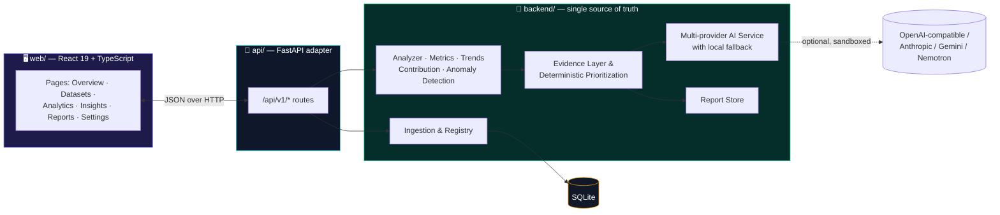

<div align="center">


# VISORA BI

### Make the hidden obvious.


<br/>

[](https://www.python.org/)
[](https://fastapi.tiangolo.com/)
[](https://react.dev/)
[](https://www.typescriptlang.org/)
[](https://vitejs.dev/)
[](LICENSE)

[](https://github.com/bilal-dev-0x/Visora-BI/stargazers)
[](https://github.com/bilal-dev-0x/Visora-BI/network/members)
[](https://github.com/bilal-dev-0x/Visora-BI/commits/main)
[]()

</div>


## Table of Contents

<details open>
<summary>Click to expand</summary>

- [What is VISORA BI](#-what-is-visora-bi)
- [The Idea](#-the-idea)
- [Architecture](#-architecture)
- [Feature Tour](#-feature-tour)
- [Tech Stack](#-tech-stack)
- [Repository Layout](#-repository-layout)
- [Getting Started](#-getting-started)
- [Configuring AI Providers](#-configuring-ai-providers-optional)
- [API Reference](#-api-reference)
- [Testing & Verification](#-testing--verification)
- [Evidence-Backed Insights](#-evidence-backed-insights)
- [Privacy by Design](#-privacy-by-design)
- [Project Status & Roadmap](#-project-status--roadmap)
- [Contributing](#-contributing)
- [License](#-license)

</details>

---

## 📌 What is VISORA BI

**VISORA BI** turns messy business CSVs into clear, evidence-backed decisions — automatically.

Upload a dataset, and VISORA cleans it, profiles it, detects the metrics and trends that matter, flags anomalies, ranks findings by importance, and explains *why* — every claim traceable back to the underlying numbers.

```
   📂 Upload  →  🧹 Clean  →  📊 Analyze  →  📈 Visualize  →  🚨 Detect  →  💡 Explain  →  🎯 Prioritize
```

> Traditional dashboards hand you dozens of charts and leave you to figure out what matters.
> **VISORA flips that: don't make users analyze the dashboard — make the dashboard analyze itself.**

---

## 🎯 The Idea

The goal is to move from *showing* data to helping people understand **what happened, why it happened, and what deserves attention next** — without needing to be a data analyst first.

<div align="center">

| Old way | VISORA way |
|:---|:---|
| Dozens of charts, no context | A short, ranked list of what actually matters |
| "Here's the data, good luck" | "Here's what changed, here's why, here's the proof" |
| AI guesses at facts | Deterministic engine computes facts; AI only interprets them |

</div>

---

## 🏗 Architecture

VISORA is a strict three-layer system. The **Python backend is the single source of truth** — the API is a thin transport adapter, and the React app never recomputes analytics.



**The contract, in one line:**

```
React (web/)  →  /api/v1/*  →  FastAPI (api/)  →  backend/  (all analytics, evidence, AI, reports)
```

If the AI layer fails, times out, or isn't configured at all, the pipeline **never blocks** — it falls back to the deterministic local engine and still returns a full, evidence-backed report.

---

## ✨ Feature Tour

<table>
<tr>
<td width="50%" valign="top">

### 📂 Ingest & Clean
- CSV / XLSX / XLSM upload, up to 150 MB
- Automatic schema detection and data-quality profiling
- Duplicate, missing-value and type-mismatch flags surfaced transparently

### 📊 Analyze
- Deterministic **Metrics Engine** for core business KPIs
- **Trend Engine** for period-over-period movement
- **Contribution Analyzer** to explain *what drove* a change
- **Anomaly Detector** for statistically unusual points

</td>
<td width="50%" valign="top">

### 🎯 Prioritize & Explain
- **Evidence layer** ties every finding back to source numbers
- Deterministic prioritization ranks findings by real impact
- Structured, multi-provider **AI interpretation** (optional) with automatic local fallback on failure

### 📈 Visualize & Report
- Interactive charts (Bar / Line / Pie / Scatter) via ECharts
- Per-dataset downloadable TXT reports, auto-cleaned on deletion
- Full JSON report export via the API

</td>
</tr>
</table>

---

## 🛠 Tech Stack

<div align="center">

**Backend**


**Frontend**


**Legacy / tooling**


</div>

| Layer | Stack |
|---|---|
| **Analytics core** (`backend/`) | Python 3.12 · Pandas · NumPy · SQLite |
| **API** (`api/`) | FastAPI · Uvicorn · Pydantic schemas · CORS-scoped to the Vite dev origins |
| **Web frontend** (`web/`) | React 19 · TypeScript (strict) · Vite 8 · Tailwind CSS v4 · Radix primitives · Motion · ECharts · Zustand · Sonner |
| **Legacy dashboard** (`frontend/`, `app.py`) | Streamlit + Plotly — kept for reference, superseded by `web/` |
| **AI layer** (`backend/ai_service.py`, `ai_providers.py`) | Pluggable 3-slot provider chain (OpenAI-compatible, Anthropic, Gemini, Nemotron) with local deterministic fallback |

---

## 📁 Repository Layout

```
Visora-BI/
├── backend/              # Single source of truth — all analytics live here
│   ├── analyzer.py           # DataAnalyzer core
│   ├── capabilities.py       # Capability detection per dataset
│   ├── metrics.py            # Metrics Engine
│   ├── trends.py             # Trend Engine
│   ├── contribution.py       # Contribution Analyzer
│   ├── anomaly.py            # Anomaly Detector
│   ├── analysis_context.py   # Analytical Context assembly
│   ├── evidence.py           # Evidence layer
│   ├── prioritization.py     # Deterministic finding prioritization
│   ├── ai_service.py         # Multi-provider AI orchestration + fallback
│   ├── ai_providers.py       # Provider adapters (OpenAI-compatible / Anthropic / Gemini / Nemotron)
│   ├── pipeline.py           # analyze_dataset() orchestration entry point
│   ├── dataset_registry.py   # Dataset persistence (SQLite)
│   ├── ingestion.py          # CSV/XLSX ingestion
│   ├── report_store.py       # JSON + per-dataset TXT report storage
│   ├── chart_selection.py    # Chart type recommendation (Bar/Line/Pie/Scatter)
│   ├── sql_safety.py         # Query safety guardrails
│   └── config.py             # Centralized env / secrets configuration
│
├── api/                  # FastAPI transport adapter — no analytics logic
│   ├── main.py                # Route definitions (/api/v1/*)
│   ├── schemas.py             # Pydantic response models
│   ├── serializers.py         # Backend row → API JSON shaping
│   └── errors.py              # Structured error envelope + handlers
│
├── web/                  # React 19 + TypeScript frontend
│   ├── src/pages/             # Overview · Datasets · Analytics · Insights · Reports · Settings
│   ├── src/components/        # ui/ · layout/ · charts/ · motion/
│   ├── src/lib/api/           # Typed API client
│   ├── src/store/              # Zustand app store
│   └── scripts/               # smoke.mjs · flow.mjs — headless Chrome E2E checks
│
├── frontend/dashboard.py # Legacy Streamlit dashboard (superseded by web/)
├── scripts/cli_report.py # Terminal-only report runner
├── tests/                 # Backend + API + integration validation suites
├── data/sales_data.csv    # Sample dataset for local testing
├── app.py                 # Streamlit entry point
└── requirements.txt       # Backend dependencies
```

---

## 🚀 Getting Started

<details open>
<summary><b>1 · Clone & install</b></summary>

```bash
git clone https://github.com/bilal-dev-0x/Visora-BI.git
cd Visora-BI

# Python backend
python -m venv .venv
source .venv/bin/activate        # Windows: .venv\Scripts\activate
pip install -r requirements.txt

# React frontend
cd web && npm install && cd ..
```

</details>

<details open>
<summary><b>2 · Run the API</b></summary>

```bash
python -m uvicorn api.main:app --reload --port 8000
```

Health check: `curl http://127.0.0.1:8000/api/v1/health`

</details>

<details open>
<summary><b>3 · Run the web frontend</b></summary>

```bash
cd web
npm run dev            # → http://localhost:5173, proxies /api → 127.0.0.1:8000
```

`VISORA_API_URL` overrides the proxy target. `npm run build` emits a production bundle to `web/dist/`.

</details>

<details>
<summary><b>Alternative: legacy Streamlit dashboard</b></summary>

```bash
streamlit run app.py
```

Kept for reference — the React app in `web/` is the actively developed frontend.

</details>

<details>
<summary><b>Alternative: terminal-only report</b></summary>

```bash
python scripts/cli_report.py
```

Runs the analytical engines directly against `data/sales_data.csv` and prints results to stdout — no server required.

</details>

---

## 🤖 Configuring AI Providers (optional)

VISORA runs fully **without** any AI provider configured — the deterministic evidence engine (`local_fallback` mode) still produces complete, ranked, evidence-backed insights on its own.

To add AI-generated interpretation on top of that, set up to three provider slots (tried in order, first configured/successful wins) via environment variables or a `.env` file in the repo root:

```bash
# Slot 1 — any OpenAI-compatible endpoint (OpenAI, Groq, OpenRouter, Together, DeepSeek, Mistral, local Ollama...)
PROVIDER_1_TYPE=openai_compatible
PROVIDER_1_API_KEY=sk-...
PROVIDER_1_MODEL=gpt-4o-mini
PROVIDER_1_BASE_URL=https://api.openai.com/v1   # optional — sensible default per TYPE

# Slot 2 — Anthropic's native Messages API
PROVIDER_2_TYPE=anthropic
PROVIDER_2_API_KEY=sk-ant-...
PROVIDER_2_MODEL=claude-sonnet-4-6

# Slot 3 — e.g. Gemini or Nemotron
PROVIDER_3_TYPE=gemini
PROVIDER_3_API_KEY=...
PROVIDER_3_MODEL=gemini-2.0-flash

# Optional tuning
VISORA_AI_TIMEOUT_SECONDS=30
```

A slot with no `API_KEY`/`MODEL` set is simply skipped — never attempted, never a hard failure. Any provider failure (timeout, error, malformed response) falls through to the next slot, and finally to the local deterministic engine.

---

## 📡 API Reference

Base URL: `http://127.0.0.1:8000`. Full contract validated by `tests/api_contract_validation.py` (49 checks).

<details>
<summary><b>Expand full route table</b></summary>

| Method | Route | Purpose |
|---|---|---|
| `GET` | `/api/v1/health` | Service status, dataset/report counts, AI provider mode |
| `GET` | `/api/v1/overview` | Dashboard KPIs + recent datasets |
| `GET` | `/api/v1/datasets` | List all datasets |
| `POST` | `/api/v1/datasets` | Upload & ingest a CSV/XLSX/XLSM file |
| `GET` | `/api/v1/datasets/{id}` | Dataset profile + current-analysis status |
| `DELETE` | `/api/v1/datasets/{id}` | Delete a dataset and its report(s) |
| `POST` | `/api/v1/datasets/{id}/analyze` | Run the unified `analyze_dataset()` pipeline |
| `GET` | `/api/v1/reports` | List generated reports |
| `GET` | `/api/v1/reports/current` | Fetch the most recent full JSON report |
| `GET` | `/api/v1/reports/{id}/text` | Download the per-dataset TXT report |
| `POST` | `/api/v1/history/clear` | Wipe all datasets and reports |
| `GET` | `/api/v1/insights` | AI-or-local-fallback ranked insight feed |

</details>

---

## ✅ Testing & Verification

<div align="center">


</div>

```bash
# Backend validation suites
python -m tests.checkpoint1_2_validation
python -m tests.checkpoint3_validation
python -m tests.checkpoint4_validation
python -m tests.api_contract_validation
python -m tests.full_matrix_validation
# ...and analytical_intelligence_validation / ai_service_validation /
#    backend_integration_validation / dashboard_report_lifecycle_validation

# Frontend
cd web
npm run typecheck      # strict TypeScript build
npm run smoke           # headless-Chrome route smoke test → .smoke/ screenshots
npm run flow             # full upload → analyze → insights → delete E2E flow
npm run verify            # typecheck + smoke + flow, all in one
```

`smoke`/`flow` drive the system Chrome/Edge install (override with `CHROME_PATH`) — no browser download required.

---

## 🧠 Evidence-Backed Insights

VISORA is built around one principle:

> **Numbers first. Interpretation second.**

Deterministic analytics produce every metric and every piece of evidence. AI, when configured, is an *interpretation layer* on top of facts that already exist — never a source of invented ones. Every insight surfaced in the UI is traceable back to the exact data that supports it.

---

## 🔐 Privacy by Design

VISORA is built **local-first**. Your business data — and the SQLite database it lives in — never has to leave your machine to produce useful analytics. AI providers are entirely optional and opt-in per environment variable.

---

## 🚧 Project Status & Roadmap

<div align="center">


</div>

VISORA BI is under **active, incremental development**, built around the core journey:

```
Upload → Clean → Analyze → Visualize → Detect → Explain → Prioritize
```

**Shipped so far:**
- ✅ Dataset registry, persistence & ingestion
- ✅ DataAnalyzer, capability detection, metrics/trend/contribution/anomaly engines
- ✅ Analytical context assembly + multi-provider AI service with local fallback
- ✅ Unified `analyze_dataset(dataset_id)` orchestration entry point
- ✅ Evidence layer + deterministic prioritization
- ✅ Structured AI results with failure-safety
- ✅ Unified JSON reports + per-dataset downloadable TXT reports (with delete cleanup)
- ✅ FastAPI transport layer with full CRUD + analyze endpoints
- ✅ React 19 / TypeScript production frontend across 6 pages
- ✅ Chart type selection (Bar / Line / Pie / Scatter)

Features and implementation details will keep evolving — this README tracks the current state, not a fixed spec.

---

## 🤝 Contributing

This is currently a solo, learning-driven build, but issues, ideas and PRs are welcome. If you spot something off in the analytics engine or the evidence chain, that's exactly the kind of thing worth opening an issue for.

---

## 📄 License

Released under the [MIT License](LICENSE) — © 2026 Bilal Aslam.

---

<div align="center">

**From data to decisions — with evidence behind every answer.**


</div>